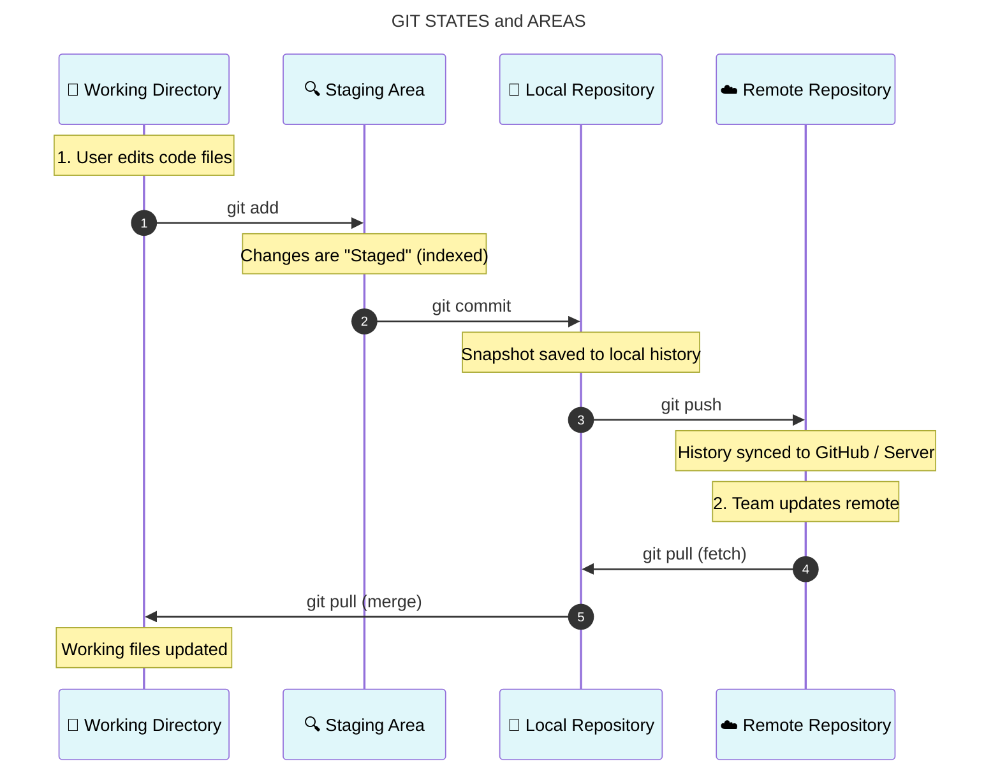

### [Day 1 — What is Git & Setup](day01_what_is_git_setup.md) | [Index](index.md) | 


# Git Learning Curriculum
## Day 2 — Staging, Committing & History

> **Goal:** Master the core Git workflow — how to actually save your work.

---

## Table of Contents
1. [The Three States of Git](#1-the-three-states-of-git)
2. [Staging Files — git add](#2-staging-files--git-add)
3. [Saving Snapshots — git commit](#3-saving-snapshots--git-commit)
4. [Writing Good Commit Messages](#4-writing-good-commit-messages)
5. [Viewing History — git log](#5-viewing-history--git-log)
6. [Seeing What Changed — git diff](#6-seeing-what-changed--git-diff)
7. [Inspecting a Commit — git show](#7-inspecting-a-commit--git-show)
8. [The Full Workflow in Practice](#8-the-full-workflow-in-practice)
9. [Day 2 Hands-On Exercise](#9-day-2-hands-on-exercise)
10. [Key Commands Summary](#10-key-commands-summary)

---

## 1. The Three States of Git

This is the most important concept in Git. Every file in your project lives in one of **three states**:


---





### Working Directory
This is your project folder — the files you actually see and edit. Any time you create, modify, or delete a file, you're working in this area. Git sees these changes but hasn't recorded them yet.

### Staging Area (Index)
Think of this as a **loading dock** or a **draft board**. You choose which changes go here before committing. This is what makes Git powerful — you can change 10 files but only commit 3 of them as one logical change, and save the other 7 for a different commit.

### Repository (.git folder)
This is the permanent history. Once you commit, the snapshot is saved forever (unless you explicitly rewrite history). Every commit builds on the last, forming a chain going all the way back to your first commit.

> 🌍 **Real-World Use Case:**
> A developer fixes a bug AND refactors some unrelated code in the same session. Using the staging area, they commit the bug fix first (so it's isolated and easy to track), then commit the refactor separately. The commit history stays clean and meaningful — each commit tells one story.

---

## 2. Staging Files — `git add`

`git add` moves changes from your **working directory** into the **staging area**. You're telling Git: *"I want to include this in my next commit."*

### Stage a Single File

```bash
git add README.md
```

### Stage Multiple Specific Files

```bash
git add index.html style.css
```

### Stage All Changes in the Current Directory

```bash
git add .
```

The `.` means "everything here and in all subdirectories." This is the most common form you'll use day-to-day.

### Stage Parts of a File (Interactive/Patch Mode)

```bash
git add -p README.md
```

This lets you stage individual **chunks (hunks)** of a file rather than the whole thing. Git will walk you through each changed section and ask `y` (yes), `n` (no), or `s` (split smaller). This is an advanced but incredibly useful technique for keeping commits clean.

> 🌍 **Real-World Use Case:**
> A developer spent the morning working on a feature and also fixed a typo in a totally unrelated file. Using `git add -p`, they stage only the feature changes for one commit, then stage the typo fix separately. The result: two clean, focused commits instead of one messy mixed one.

### Check What's Staged

After `git add`, always run `git status` to confirm what's staged:

```bash
git status
```

Output:

```
On branch main

Changes to be committed:
  (use "git restore --staged <file>..." to unstage)
        new file:   README.md
        new file:   index.html

Untracked files:
  (use "git add <file>..." to include in what will be committed)
        notes.txt
```

- **"Changes to be committed"** → staged, ready to commit ✅
- **"Untracked files"** → not staged, won't be in the next commit ❌

### Unstage a File (Oops, Wrong File)

If you staged something by mistake:

```bash
git restore --staged index.html
```

This moves the file back to the working directory without losing your changes.

---

## 3. Saving Snapshots — `git commit`

`git commit` takes everything in the staging area and saves it permanently to the repository as a **snapshot**. Every commit gets a unique ID (a SHA hash like `a3f9c12`), an author, a timestamp, and your message.

### Basic Commit

```bash
git commit -m "Add README and initial project structure"
```

The `-m` flag lets you write the commit message inline. Without it, Git opens your configured text editor for you to type a message.

### Commit All Tracked Changes (Skip Staging)

```bash
git commit -am "Fix typo in homepage"
```

The `-a` flag automatically stages all **modified tracked files** and commits them in one step. Note: this does **not** include brand new (untracked) files — those still need `git add` first.

### Amend the Last Commit

Made a typo in your last commit message, or forgot to include a file?

```bash
# Stage the forgotten file first (if needed)
git add forgotten-file.txt

# Amend the previous commit
git commit --amend -m "Correct commit message here"
```

> ⚠️ **Warning:** Only amend commits that haven't been pushed to a shared remote yet. Amending rewrites history, which can cause problems for teammates.

### What Happens Under the Hood

When you commit, Git:
1. Takes a snapshot of everything in the staging area
2. Computes a SHA-1 hash of that snapshot (the commit ID)
3. Stores the commit object with your name, email, timestamp, message, and a pointer to the previous commit
4. Moves the branch pointer (e.g., `main`) forward to the new commit

```
Before commit:           After commit:
                         
main                     main
  ↓                        ↓
[a1b2c3]    ────────►   [a1b2c3] ← [d4e5f6]
 initial                  initial    "Add README"
```

> 🌍 **Real-World Use Case:**
> A backend developer finishes implementing a login endpoint. They stage only the auth-related files and commit with the message `"feat: implement JWT login endpoint"`. Six months later, a teammate can look at this exact commit, understand precisely what changed, and why — without needing to ask anyone.

---

## 4. Writing Good Commit Messages

A commit message is a letter to your future self and your teammates. Bad messages make history useless. Good messages make it invaluable.

### The Golden Rules

**1. Use the imperative mood in the subject line**

Write commit messages as if completing the sentence: *"If applied, this commit will..."*

```
✅  Add user authentication
✅  Fix null pointer error in checkout
✅  Remove deprecated payment API
✅  Update README with setup instructions

❌  Added user authentication
❌  Fixed a bug
❌  Changes
❌  WIP
```

**2. Keep the subject line under 50 characters**

This ensures it displays cleanly in `git log`, GitHub, and other tools.

**3. Add a body when context is needed**

Leave a blank line after the subject, then explain the *why*, not the *what*:

```
Fix race condition in order processing

The checkout endpoint was occasionally processing duplicate
orders when users double-clicked the submit button. Added
an idempotency key check before order creation to prevent
this. Fixes issue #482.
```

**4. Reference issue numbers when applicable**

```bash
git commit -m "Fix login redirect loop (closes #231)"
```

### Common Commit Prefixes (Conventional Commits)

Many teams follow the **Conventional Commits** standard:

| Prefix | When to Use |
|---|---|
| `feat:` | A new feature |
| `fix:` | A bug fix |
| `docs:` | Documentation changes only |
| `style:` | Formatting, missing semicolons, etc. |
| `refactor:` | Code change that isn't a fix or feature |
| `test:` | Adding or updating tests |
| `chore:` | Build process, dependency updates |

Example: `feat: add dark mode toggle to settings page`

---

## 5. Viewing History — `git log`

`git log` shows the commit history of your repository — every snapshot ever saved, who saved it, and when.

### Basic Log

```bash
git log
```

Output:

```
commit d4e5f6a7b8c9d0e1f2a3b4c5d6e7f8a9b0c1d2e3
Author: Jane Smith <jane@example.com>
Date:   Mon Feb 17 10:22:41 2025 +0530

    feat: add user login page

commit a1b2c3d4e5f6a7b8c9d0e1f2a3b4c5d6e7f8a9b0
Author: Jane Smith <jane@example.com>
Date:   Sun Feb 16 09:10:15 2025 +0530

    initial commit: add README and project structure
```

Press `q` to quit the log view.

### One-Line Log (Compact View)

```bash
git log --oneline
```

Output:

```
d4e5f6a feat: add user login page
a1b2c3d initial commit: add README and project structure
```

This is the view most developers use day-to-day. Clean and scannable.

### Visual Branch Graph

```bash
git log --oneline --graph --all
```

Output:

```
* d4e5f6a (HEAD -> main) feat: add user login page
* a1b2c3d initial commit
```

When you have branches, this shows a visual tree — extremely useful for understanding how branches relate to each other.

### Filter the Log

```bash
# Show only the last 5 commits
git log -5

# Show commits by a specific author
git log --author="Jane"

# Show commits from a date range
git log --after="2025-01-01" --before="2025-02-01"

# Show commits that affected a specific file
git log -- index.html

# Search commit messages
git log --grep="login"
```

> 🌍 **Real-World Use Case:**
> A bug was introduced sometime last week. A developer runs `git log --oneline --after="2025-02-10"` to see all commits from that period, then reads through them to find the likely culprit — all without touching a single file.

---

## 6. Seeing What Changed — `git diff`

`git diff` shows the exact line-by-line differences between versions of your files. It answers: *"What exactly changed?"*

### Diff Your Unstaged Changes

Shows changes in your working directory that are **not yet staged**:

```bash
git diff
```

Output:

```diff
diff --git a/index.html b/index.html
index 83db48f..f735c62 100644
--- a/index.html
+++ b/index.html
@@ -1,5 +1,6 @@
 <!DOCTYPE html>
 <html>
-  <title>My Site</title>
+  <title>My Awesome Site</title>
+  <meta name="description" content="A personal portfolio">
 </html>
```

- Lines starting with `-` (red) = what was removed
- Lines starting with `+` (green) = what was added
- Lines with no symbol = unchanged context

### Diff Your Staged Changes

Shows changes that **are staged** (ready to commit) vs the last commit:

```bash
git diff --staged
```

This is what you'll actually be committing. Always run this before committing for a final review.

### Diff Between Two Commits

```bash
git diff a1b2c3 d4e5f6
```

### Diff a Specific File

```bash
git diff index.html
```

### Diff Against the Last Commit

```bash
git diff HEAD
```

> 🌍 **Real-World Use Case:**
> Before pushing code to production, a senior developer always runs `git diff --staged` to do a final self-review. This catches accidental debug logs, commented-out code, or unintended changes before they go into the repository.

---

## 7. Inspecting a Commit — `git show`

`git show` lets you examine a specific commit in detail — what changed, who did it, and when.

### Show the Latest Commit

```bash
git show
```

### Show a Specific Commit

```bash
git show d4e5f6a
```

Output:

```
commit d4e5f6a7b8c9...
Author: Jane Smith <jane@example.com>
Date:   Mon Feb 17 10:22:41 2025 +0530

    feat: add user login page

diff --git a/login.html b/login.html
new file mode 100644
index 0000000..83db48f
--- /dev/null
+++ b/login.html
@@ -0,0 +1,12 @@
+<!DOCTYPE html>
+<html>
+  <body>
+    <h1>Login</h1>
+  </body>
+</html>
```

### Show Only the Files Changed in a Commit

```bash
git show --stat d4e5f6a
```

Output:

```
commit d4e5f6a
Author: Jane Smith <jane@example.com>

    feat: add user login page

 login.html | 12 ++++++++++++
 1 file changed, 12 insertions(+)
```

---

## 8. The Full Workflow in Practice

Here's the complete, real-world Git workflow you'll use every single day:

```bash
# 1. Make changes to your files
# (edit code, create files, delete files)

# 2. See what changed
git status

# 3. Review the actual changes line by line
git diff

# 4. Stage the changes you want to commit
git add index.html style.css

# 5. Double-check what you're about to commit
git diff --staged

# 6. Commit with a meaningful message
git commit -m "feat: add responsive navbar"

# 7. Verify the commit was recorded
git log --oneline
```

Repeat this loop constantly throughout your workday. Commit often — small, focused commits are always better than one giant commit at the end of the day.

> 🌍 **Real-World Use Case:**
> A developer building a new dashboard feature makes commits like:
> - `feat: add dashboard layout skeleton`
> - `feat: connect dashboard to user API`
> - `fix: handle empty state when no data`
> - `style: polish card spacing on mobile`
>
> Each commit is a clear, atomic step. If the API change breaks something, it can be isolated and reverted without touching the layout work. This is professional-grade version control.

---

## 9. Day 2 Hands-On Exercise

Continue from where you left off in the `learning-git` folder from Day 1.

### Step 1 — Create Some Files to Work With

```bash
cd ~/Desktop/learning-git

# Create project files
echo "<!DOCTYPE html><html><body><h1>Hello Git</h1></body></html>" > index.html
echo "body { font-family: Arial; }" > style.css
echo "console.log('Hello');" > app.js

# Check status — all three should be untracked
git status
```

### Step 2 — Stage and Commit in Two Batches

```bash
# Stage only the HTML and CSS (not the JS yet)
git add index.html style.css

# Check what's staged vs what isn't
git status

# Commit the first batch
git commit -m "feat: add HTML structure and base styles"

# Now stage and commit the JS separately
git add app.js
git commit -m "feat: add initial JavaScript entry point"
```

### Step 3 — Modify a File and See the Diff

```bash
# Edit the README
echo "## Project Setup" >> README.md
echo "Open index.html in a browser to get started." >> README.md

# See what changed (unstaged diff)
git diff README.md

# Stage it
git add README.md

# See staged diff (final check before commit)
git diff --staged

# Commit
git commit -m "docs: add setup instructions to README"
```

### Step 4 — Explore the History

```bash
# Full log
git log

# Compact one-line view
git log --oneline

# Inspect your first commit in detail
git show HEAD~2
# HEAD~2 means "2 commits before the current one"

# See just the file list for each commit
git log --oneline --stat
```

### Step 5 — Practice the Amend Workflow

```bash
# Make a commit with a deliberate typo
echo "/* new styles */" >> style.css
git add style.css
git commit -m "stlye: update stylesheet"

# Fix the typo with amend
git commit --amend -m "style: update stylesheet"

# Verify the fix
git log --oneline
```

> ✅ **What You Should Have After This Exercise:**
> - At least 4-5 commits in your log
> - Experience staging files selectively
> - Confidence reading `git diff` output
> - A clean, readable commit history

---

## 10. Key Commands Summary

| Command | What It Does | Common Usage |
|---|---|---|
| `git add <file>` | Stage a specific file | `git add index.html` |
| `git add .` | Stage all changes in current directory | `git add .` |
| `git add -p` | Interactively stage chunks of a file | `git add -p style.css` |
| `git restore --staged <file>` | Unstage a file (keep changes) | `git restore --staged index.html` |
| `git commit -m` | Commit with an inline message | `git commit -m "fix: resolve login bug"` |
| `git commit -am` | Stage tracked files and commit together | `git commit -am "fix: typo"` |
| `git commit --amend` | Modify the most recent commit | `git commit --amend -m "better message"` |
| `git log` | View full commit history | `git log` |
| `git log --oneline` | View compact commit history | `git log --oneline` |
| `git log --oneline --graph --all` | Visual branch history | `git log --oneline --graph --all` |
| `git diff` | Show unstaged changes | `git diff` |
| `git diff --staged` | Show staged changes (pre-commit review) | `git diff --staged` |
| `git show <commit>` | Inspect a specific commit | `git show a1b2c3d` |

---

## Coming Up on Day 3 — Branching & Merging

Tomorrow you'll unlock Git's true superpower: **branches**. You'll learn:

- `git branch` — creating and listing branches
- `git switch` — jumping between branches
- `git merge` — combining branches back together
- How to **create and resolve a merge conflict** — the most important skill of the week

Branches are what allow teams of 50 developers to work on the same codebase simultaneously without stepping on each other. Understanding them deeply will transform how you think about coding workflows.

---

*Git Learning Curriculum — Day 2 of 7*