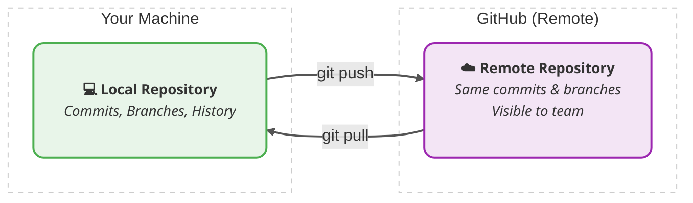

### &larr; [Day 3 — Branching & Merging](day03_branching_merging.md) | [Index](index.md) | [Day 5 — Rewriting History & Undoing Things](day05_rewriting_undoing_history.md) &rarr;

---


# Git Learning Curriculum
## Day 4 — Remote Repositories & GitHub

> **Goal:** Push your code to the cloud, pull changes from others, and understand the collaboration workflow that powers modern software teams.

---

## Table of Contents
1. [What is a Remote Repository?](#1-what-is-a-remote-repository)
2. [Setting Up GitHub](#2-setting-up-github)
3. [Cloning a Repository — git clone](#3-cloning-a-repository--git-clone)
4. [Connecting to a Remote — git remote](#4-connecting-to-a-remote--git-remote)
5. [Pushing Changes — git push](#5-pushing-changes--git-push)
6. [Fetching Changes — git fetch](#6-fetching-changes--git-fetch)
7. [Pulling Changes — git pull](#7-pulling-changes--git-pull)
8. [The Fork → Clone → Push → Pull Request Workflow](#8-the-fork--clone--push--pull-request-workflow)
9. [Tracking Branches & Remote Refs](#9-tracking-branches--remote-refs)
10. [Common Remote Scenarios](#10-common-remote-scenarios)
11. [Day 4 Hands-On Exercise](#11-day-4-hands-on-exercise)
12. [Key Commands Summary](#12-key-commands-summary)

---

## 1. What is a Remote Repository?

So far everything you've done has been **local** — your commits, branches, and history only exist on your machine. A **remote repository** is a version of your project hosted on a server (like GitHub, GitLab, or Bitbucket) that you and your team can all access.




```
Your Machine                        GitHub (Remote)
─────────────────                   ─────────────────────────
  Local Repo                              Remote Repo
  ┌──────────┐    git push ──────►   ┌──────────────────┐
  │  commits │                       │  same commits    │
  │  branches│    ◄────── git pull   │  branches        │
  │  history │                       │  visible to team │
  └──────────┘                       └──────────────────┘
```

The remote serves three key purposes:

- **Backup** — your work is safe even if your laptop dies
- **Collaboration** — teammates can see, pull, and build on your work
- **Deployment** — CI/CD pipelines watch your remote and deploy automatically when you push

> 🌍 **Real-World Use Case:**
> A startup's entire codebase lives on GitHub. When a developer's laptop is stolen, they simply clone the repository onto a new machine and are back to full productivity in minutes. Nothing is lost because every commit was pushed to the remote.

---

## 2. Setting Up GitHub

### Create a GitHub Account

Go to [https://github.com](https://github.com) and sign up for a free account if you don't have one.

### Set Up SSH Authentication (Recommended)

SSH keys let you push and pull without typing a password every time. This is the professional standard.

**Step 1 — Generate an SSH key:**

```bash
ssh-keygen -t ed25519 -C "your@email.com"
# Press Enter to accept the default file location
# Optionally add a passphrase for extra security
```

**Step 2 — Copy your public key:**

```bash
# On macOS
cat ~/.ssh/id_ed25519.pub | pbcopy

# On Linux
cat ~/.ssh/id_ed25519.pub
# Then manually copy the output

# On Windows (Git Bash)
cat ~/.ssh/id_ed25519.pub | clip
```

**Step 3 — Add it to GitHub:**

Go to GitHub → Settings → SSH and GPG keys → New SSH key → paste your key → Save.

**Step 4 — Test the connection:**

```bash
ssh -T git@github.com
# Output: Hi username! You've successfully authenticated...
```

### Alternative — HTTPS Authentication

If you prefer HTTPS over SSH, GitHub now requires a **Personal Access Token (PAT)** instead of your password:

Go to GitHub → Settings → Developer Settings → Personal access tokens → Generate new token.

Use this token as your password when Git prompts you.

---

## 3. Cloning a Repository — `git clone`

`git clone` downloads a remote repository to your local machine — complete with all commits, branches, and history.

### Basic Clone

```bash
git clone https://github.com/username/repository-name.git
```

This creates a folder called `repository-name` in your current directory, containing the full project.

### Clone with SSH (Recommended if SSH is set up)

```bash
git clone git@github.com:username/repository-name.git
```

### Clone into a Custom Folder Name

```bash
git clone git@github.com:username/repo.git my-project
```

### Clone a Specific Branch

```bash
git clone -b develop git@github.com:username/repo.git
```

### What Clone Does Under the Hood

When you clone, Git automatically:
1. Downloads the entire repository history
2. Creates a local copy of all branches
3. Sets up a remote called `origin` pointing to the URL you cloned from
4. Checks out the default branch (usually `main`)
5. Sets up tracking so `git pull` and `git push` know where to go

```bash
# After cloning, verify what remote was set up
git remote -v
# Output:
# origin  git@github.com:username/repo.git (fetch)
# origin  git@github.com:username/repo.git (push)
```

> 🌍 **Real-World Use Case:**
> A new developer joins a team on their first day. The tech lead says "clone the repo and you're ready to go." One command gives them the entire codebase, all its history going back years, and every branch the team has ever worked on. No manual file transfers, no zip files — just `git clone`.

---

## 4. Connecting to a Remote — `git remote`

If you created a local repository with `git init` (rather than cloning), you need to manually connect it to a remote.

### Add a Remote

```bash
git remote add origin git@github.com:username/repo.git
```

`origin` is the conventional name for your primary remote. You can name it anything, but `origin` is universally understood.

### View All Remotes

```bash
git remote -v
```

Output:

```
origin  git@github.com:username/my-project.git (fetch)
origin  git@github.com:username/my-project.git (push)
```

### Change a Remote URL

```bash
# Useful when switching from HTTPS to SSH
git remote set-url origin git@github.com:username/repo.git
```

### Remove a Remote

```bash
git remote remove origin
```

### Add a Second Remote

Teams sometimes use multiple remotes — for example, `origin` for their fork and `upstream` for the original project:

```bash
git remote add upstream git@github.com:original-org/repo.git
git remote -v
# origin    git@github.com:you/repo.git (fetch)
# origin    git@github.com:you/repo.git (push)
# upstream  git@github.com:original-org/repo.git (fetch)
# upstream  git@github.com:original-org/repo.git (push)
```

---

## 5. Pushing Changes — `git push`

`git push` uploads your local commits to the remote repository. This is how your work becomes visible to teammates.

### First Push (Set Upstream)

The first time you push a branch, use `-u` to set the upstream tracking branch:

```bash
git push -u origin main
```

After this, you can just run `git push` for all future pushes on this branch — Git remembers where to send it.

### Regular Push (After Upstream is Set)

```bash
git push
```

### Push a Feature Branch

```bash
git push -u origin feature-login
```

This creates the branch on the remote if it doesn't exist yet.

### Force Push (Use With Extreme Caution)

```bash
git push --force
# Safer alternative:
git push --force-with-lease
```

Force push overwrites the remote history. Only use it on your own personal branches that no one else is working on — never on `main` or shared branches.

`--force-with-lease` is the safer version: it refuses to force push if someone else has pushed to the branch since you last fetched, preventing you from accidentally overwriting a teammate's work.

> ⚠️ **Warning:** Force pushing to a shared branch is one of the most disruptive things you can do on a team. It rewrites history that others have already pulled, causing serious problems. Always communicate before force pushing, and prefer safer alternatives like `git revert`.

### Push Tags

```bash
# Push a specific tag
git push origin v1.0.0

# Push all tags
git push origin --tags
```

> 🌍 **Real-World Use Case:**
> A developer finishes a feature at 5pm on Friday. Before logging off, they push their branch to GitHub. Over the weekend, their laptop battery dies completely. On Monday, they clone fresh, switch to their branch, and all their work is exactly where they left it — safe on the remote.

---

## 6. Fetching Changes — `git fetch`

`git fetch` downloads changes from the remote but **does not modify your working directory or current branch**. It simply updates your knowledge of what's on the remote.

### Fetch from Origin

```bash
git fetch origin
```

### Fetch All Remotes

```bash
git fetch --all
```

### What Fetch Actually Does

After fetching, your remote tracking branches (like `origin/main`) are updated, but your local `main` stays exactly the same. You can then inspect what changed before deciding to merge:

```bash
# Fetch the latest
git fetch origin

# See what changed on the remote main vs your local main
git log main..origin/main --oneline

# See the actual diff
git diff main origin/main

# Decide to merge when you're ready
git merge origin/main
```

### Fetch vs Pull

| | `git fetch` | `git pull` |
|---|---|---|
| Downloads remote changes | ✅ | ✅ |
| Updates your working branch | ❌ | ✅ |
| Safe to run anytime | ✅ | Use with care |
| Lets you review before merging | ✅ | ❌ |
| Best for | Checking what changed | Quick sync when you trust the remote |

> 🌍 **Real-World Use Case:**
> Before starting work each morning, a careful developer runs `git fetch` first. They then check `git log origin/main --oneline` to see what teammates committed overnight. Only after reviewing the changes do they decide whether to merge or rebase. This prevents surprise conflicts mid-day.

---

## 7. Pulling Changes — `git pull`

`git pull` is essentially `git fetch` + `git merge` in one command. It downloads remote changes and immediately integrates them into your current branch.

### Basic Pull

```bash
git pull
# Equivalent to:
git fetch origin
git merge origin/main
```

### Pull from a Specific Remote and Branch

```bash
git pull origin main
```

### Pull with Rebase (Cleaner History)

```bash
git pull --rebase
```

Instead of creating a merge commit, this replays your local commits on top of the fetched commits. The result is a linear history with no merge bubbles. Many teams prefer this:

```bash
# Set rebase as the default pull strategy
git config --global pull.rebase true
```

### Handling Pull Conflicts

If a pull brings in changes that conflict with your local work, Git will pause and show a conflict — exactly like a merge conflict from Day 3. Resolve it the same way:

```bash
git pull
# CONFLICT (content): Merge conflict in app.js
# Automatic merge failed; fix conflicts and then commit the result.

# Fix the conflicts in your editor
git add app.js
git commit -m "merge: resolve conflict from remote pull"
```

> 🌍 **Real-World Use Case:**
> Two developers are working on the same project. Developer A pushes a config update. Developer B pulls before starting their day, getting A's changes automatically. They both stay in sync without ever emailing files back and forth.

---

## 8. The Fork → Clone → Push → Pull Request Workflow

This is the **standard open source and team collaboration workflow**. Understanding it is essential for working on any real project.

### What is a Fork?

A **fork** is your own personal copy of someone else's repository on GitHub. It lives in your GitHub account, not the original. You have full control over it.

```
Original Repo                    Your Fork
(org/project)     Fork ──────►  (you/project)
     │                               │
     │                           git clone
     │                               │
     │                          Your Machine
     │                               │
     │◄──── Pull Request ────────────┘
```

### The Full Workflow Step by Step

**Step 1 — Fork the repository on GitHub**

Click the "Fork" button on any GitHub repository. This creates `github.com/your-username/project`.

**Step 2 — Clone your fork locally**

```bash
git clone git@github.com:your-username/project.git
cd project
```

**Step 3 — Add the original as "upstream"**

```bash
git remote add upstream git@github.com:original-org/project.git
git remote -v
# origin    git@github.com:your-username/project.git
# upstream  git@github.com:original-org/project.git
```

**Step 4 — Create a feature branch**

```bash
git switch -c feature/improve-docs
```

**Step 5 — Make your changes and commit**

```bash
# Edit files...
git add .
git commit -m "docs: improve installation instructions"
```

**Step 6 — Keep your fork in sync with upstream**

```bash
git fetch upstream
git switch main
git merge upstream/main
git push origin main
```

**Step 7 — Push your feature branch to your fork**

```bash
git push -u origin feature/improve-docs
```

**Step 8 — Open a Pull Request on GitHub**

Go to GitHub → your fork → click "Compare & pull request" → write a description → Submit.

**Step 9 — Address review feedback**

```bash
# Make requested changes
git add .
git commit -m "docs: address review feedback on setup section"
git push
# The PR updates automatically
```

**Step 10 — PR is merged by a maintainer**

Your code is now part of the original project. Delete your branch:

```bash
git branch -d feature/improve-docs
git push origin --delete feature/improve-docs
```

> 🌍 **Real-World Use Case:**
> This exact workflow is how millions of contributions are made to open source projects like React, VS Code, and Linux every day. Companies like Google, Meta, and Microsoft use variations of this pattern for internal development too — it's the backbone of modern collaborative software development.

---

## 9. Tracking Branches & Remote Refs

### What are Remote Tracking Branches?

When you fetch or clone, Git creates **remote tracking branches** — read-only local references to the state of branches on the remote. They look like `origin/main`, `origin/feature-login`, etc.

```bash
# See all remote tracking branches
git branch -r

# Output:
# origin/HEAD -> origin/main
# origin/main
# origin/feature-login
# origin/bugfix-header
```

You can't commit directly to a remote tracking branch — they update only when you fetch.

### See Where Your Branch Tracks

```bash
git branch -vv
```

Output:

```
* main          a1b2c3d [origin/main] feat: add homepage
  feature-login d4e5f6a [origin/feature-login: ahead 2] feat: login form
  local-only    f7g8h9i local branch with no remote
```

- `ahead 2` → you have 2 commits not yet pushed to remote
- `behind 3` → remote has 3 commits you haven't pulled yet
- `ahead 1, behind 2` → both sides have new commits (need to pull then push)

### Set Upstream Tracking for an Existing Branch

```bash
git branch --set-upstream-to=origin/main main
```

---

## 10. Common Remote Scenarios

### Scenario 1 — Push Rejected Because Remote Has New Commits

```bash
git push
# error: failed to push some refs
# hint: Updates were rejected because the remote contains work
# hint: that you do not have locally.
```

**Solution:** Pull first, then push:

```bash
git pull --rebase
git push
```

### Scenario 2 — Collaborator Deleted a Branch but it Still Shows Locally

```bash
# Clean up stale remote tracking branches
git fetch --prune
# or
git remote prune origin
```

### Scenario 3 — You Want to See a Remote Branch Locally

```bash
# Fetch all remote branches
git fetch origin

# Create a local branch tracking the remote one
git switch -c feature-login origin/feature-login
# or shorthand:
git switch feature-login  # Git auto-detects the remote branch
```

### Scenario 4 — Undo a Push (You Pushed Something Wrong)

```bash
# Create a revert commit (safe — doesn't rewrite history)
git revert HEAD
git push

# Or if it's your own branch and no one else has it:
git reset HEAD~1
git push --force-with-lease
```

### Scenario 5 — Check What Would Be Pushed Before Pushing

```bash
# See commits that are local but not on remote
git log origin/main..HEAD --oneline
```

---

## 11. Day 4 Hands-On Exercise

For this exercise you'll need a GitHub account. This simulates the complete real-world remote workflow.

### Step 1 — Create a Repository on GitHub

1. Go to [https://github.com/new](https://github.com/new)
2. Name it `learning-git`
3. Leave it empty (no README, no .gitignore)
4. Click "Create repository"

### Step 2 — Connect Your Local Repo to GitHub

```bash
cd ~/Desktop/learning-git

# Add GitHub as the remote
git remote add origin git@github.com:YOUR_USERNAME/learning-git.git

# Verify it's connected
git remote -v

# Push your existing commits to GitHub
git push -u origin main
```

Now visit `https://github.com/YOUR_USERNAME/learning-git` — your commits are live!

### Step 3 — Make a Change and Push It

```bash
# Create a new file
echo "# Contributing Guide" > CONTRIBUTING.md
echo "Please open a Pull Request for all changes." >> CONTRIBUTING.md

git add CONTRIBUTING.md
git commit -m "docs: add contributing guide"

# Push — no need for -u this time
git push
```

Refresh your GitHub page and watch the new file appear.

### Step 4 — Simulate a Remote Change (Edit on GitHub)

1. On GitHub, click on `README.md`
2. Click the pencil (edit) icon
3. Add a line: `## Status: Active`
4. Click "Commit changes" directly on GitHub

Now your remote has a commit your local machine doesn't know about.

### Step 5 — Fetch and Inspect Before Pulling

```bash
# Fetch to see what changed (doesn't modify your files)
git fetch origin

# See what's new on the remote
git log origin/main --oneline

# Compare remote vs local
git diff HEAD origin/main

# Now pull to sync
git pull
```

### Step 6 — Create a Feature Branch and Open a Pull Request

```bash
# Create a feature branch
git switch -c feature/add-license

# Add a license file
echo "MIT License - $(date +%Y) Your Name" > LICENSE
git add LICENSE
git commit -m "chore: add MIT license"

# Push the branch to GitHub
git push -u origin feature/add-license
```

Now go to GitHub — you'll see a yellow banner saying "feature/add-license had recent pushes". Click "Compare & pull request", write a description, and open the PR.

Then merge it on GitHub, and clean up locally:

```bash
git switch main
git pull
git branch -d feature/add-license
```

### Step 7 — Explore Your Remote State

```bash
# See all branches (local + remote)
git branch -a

# See tracking status of each branch
git branch -vv

# Clean up remote tracking refs for deleted branches
git fetch --prune
```

> ✅ **What You Should Have After This Exercise:**
> - A public GitHub repository with your learning-git project
> - Experience pushing, fetching, and pulling
> - A merged Pull Request in your repository's history
> - Confidence with the complete local ↔ remote workflow

---

## 12. Key Commands Summary

| Command | What It Does | Common Usage |
|---|---|---|
| `git clone <url>` | Download a remote repo locally | `git clone git@github.com:user/repo.git` |
| `git remote add` | Connect a local repo to a remote | `git remote add origin <url>` |
| `git remote -v` | List all remotes and their URLs | `git remote -v` |
| `git remote set-url` | Change a remote's URL | `git remote set-url origin <new-url>` |
| `git push -u origin <branch>` | Push and set upstream tracking | `git push -u origin main` |
| `git push` | Push commits to tracked remote branch | `git push` |
| `git push --force-with-lease` | Safe force push | `git push --force-with-lease` |
| `git fetch` | Download remote changes without merging | `git fetch origin` |
| `git fetch --prune` | Fetch and remove stale remote refs | `git fetch --prune` |
| `git pull` | Fetch and merge remote changes | `git pull` |
| `git pull --rebase` | Fetch and rebase instead of merge | `git pull --rebase` |
| `git branch -r` | List remote tracking branches | `git branch -r` |
| `git branch -vv` | Show tracking info for all branches | `git branch -vv` |
| `git log origin/main..HEAD` | See unpushed local commits | `git log origin/main..HEAD --oneline` |
| `git push origin --delete <b>` | Delete a branch on the remote | `git push origin --delete feature-login` |

---

### &larr; [Day 3 — Branching & Merging](day03_branching_merging.md) | [Index](index.md) | [Day 5 — Rewriting History & Undoing Things](day05_rewriting_undoing_history.md) &rarr;